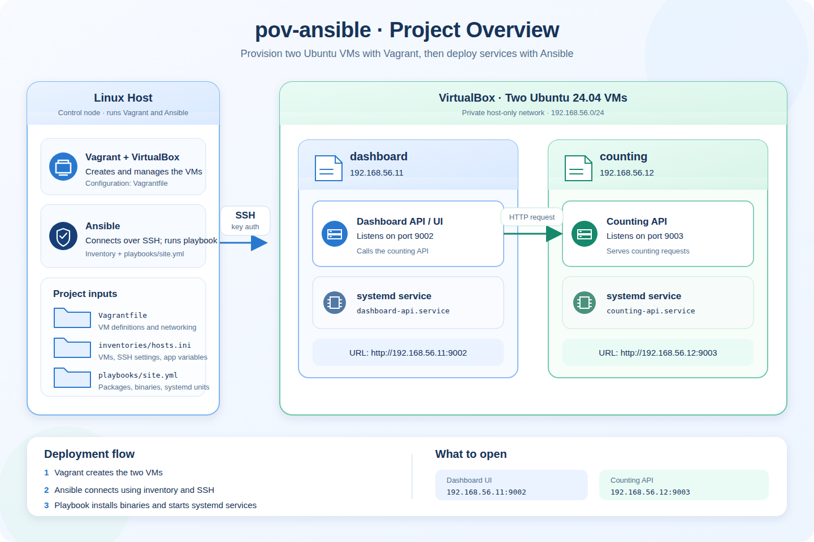

# pov-ansible

A hands-on **Vagrant and Ansible** lab. Vagrant creates two Ubuntu virtual
machines; Ansible connects to them over SSH, installs demo applications, and
configures them as systemd services.

## Project overview



## Dashboard Demo


## Architecture

| VM | Private IP | Service | Port |
| --- | --- | --- | --- |
| `dashboard` | `192.168.56.11` | Dashboard API / UI (`dashboard-api.service`) | `9002` |
| `counting` | `192.168.56.12` | Counting API (`counting-api.service`) | `9003` |

Both VMs run Ubuntu 24.04 under VirtualBox and communicate over a private
network. The dashboard calls the counting API.

## Requirements

On the Linux host, install:

- [VirtualBox](https://www.virtualbox.org/)
- [Vagrant](https://developer.hashicorp.com/vagrant)
- [Ansible](https://docs.ansible.com/ansible/latest/installation_guide/intro_installation.html)
- `curl` for the optional HTTP checks

## Quick start

Run the following commands from the project directory.

### 1. Create a dedicated SSH key

Use a lab-specific key outside the repository. This avoids overwriting your
default SSH key and keeps the private key out of the project:

```bash
mkdir -p ~/.ssh
ssh-keygen -t ed25519 -f ~/.ssh/pov-ansible -N "" -C "pov-ansible-lab"
chmod 600 ~/.ssh/pov-ansible
```

### 2. Configure the SSH key paths

In `Vagrantfile`, set `PUBLIC_KEY_PATH` to the absolute path of
`~/.ssh/pov-ansible.pub`. For example, you can use this Ruby expression:

```ruby
PUBLIC_KEY_PATH = File.expand_path("~/.ssh/pov-ansible.pub").freeze
```

In `inventories/hosts.ini`, set `ansible_ssh_private_key_file` to the absolute
path of `~/.ssh/pov-ansible`. To print that path, run:

```bash
realpath ~/.ssh/pov-ansible
```

Copy the printed path into the inventory. Keep the public and private key paths
paired: Vagrant installs the public key in each VM, and Ansible uses the private
key to connect.

### 3. Create and start the VMs

```bash
vagrant validate
vagrant up
vagrant status
```

The first `vagrant up` downloads the Ubuntu box and may take several minutes.
The status should show both `dashboard` and `counting` as `running`.

### 4. Check the Ansible inventory and connections

```bash
ansible-inventory -i inventories/hosts.ini --graph
ansible all -i inventories/hosts.ini -m ansible.builtin.ping
```

The graph should list both hosts, and each should return `"ping": "pong"`.
Ansible may ask you to trust each VM's SSH host key the first time it connects.
Confirm only after checking that the IP is one of this lab's VMs.

### 5. Check and run the playbook

Check that Ansible can parse the playbook:

```bash
ansible-playbook -i inventories/hosts.ini playbooks/site.yml --syntax-check
```

Then configure the VMs and start the services:

```bash
ansible-playbook -i inventories/hosts.ini playbooks/site.yml
```

The playbook installs utility packages, downloads the Linux `amd64` demo
binaries, installs systemd unit files, and enables and starts both services.
The `amd64` binaries are for x86-64 VMs; ARM hosts need compatible binaries
and a matching VM box.

### 6. Verify the services

Each command should report `active`:

```bash
ansible dashboard -i inventories/hosts.ini -b -m ansible.builtin.command -a "systemctl is-active dashboard-api"
ansible counting -i inventories/hosts.ini -b -m ansible.builtin.command -a "systemctl is-active counting-api"
```

Open the dashboard at <http://192.168.56.11:9002>. You can also check the
endpoints from the host:

```bash
curl -i http://192.168.56.11:9002
curl -i http://192.168.56.12:9003
```

## Useful commands

Run the playbook again after changing configuration; Ansible playbooks are
designed to be repeatable:

```bash
ansible-playbook -i inventories/hosts.ini playbooks/site.yml
```

Stop the VMs but keep them:

```bash
vagrant halt
```

Start them again:

```bash
vagrant up
```

Permanently remove the VMs:

```bash
vagrant destroy
```

Vagrant asks for confirmation before destroying them. Add `-f` to skip the
confirmation.

## Project structure

```text
pov-ansible/
├── assets/
│   ├── Ansible_Project_Overview.png
│   ├── Ansible_Project_Overview.svg
│   └── example.png
├── inventories/
│   └── hosts.ini
├── playbooks/
│   ├── site.yml
│   └── templates/
│       ├── counting.service.j2
│       └── dashboard.service.j2
├── README.md
└── Vagrantfile
```

## What this lab demonstrates

- Defining VMs and private networking with Vagrant
- Grouping hosts and setting connection variables in an Ansible inventory
- Writing multi-play Ansible playbooks and reusable Jinja2 templates
- Managing Linux services with systemd and Ansible handlers
- Re-running configuration safely and checking service health

## SSH key safety

Never commit or share a private SSH key. Use a dedicated lab key stored outside
this repository, and do not use a key from a downloaded repository for personal
or production access. If a private key has been used outside this disposable
lab or shared publicly, revoke it and replace it.

## References

- [Ansible documentation](https://docs.ansible.com/)
- [Vagrant documentation](https://developer.hashicorp.com/vagrant/docs)
- [VirtualBox](https://www.virtualbox.org/)
- [Reference project](https://gitlab.com/sailinnthu/pov-vagrant/-/tree/03-ansible?ref_type=heads)
